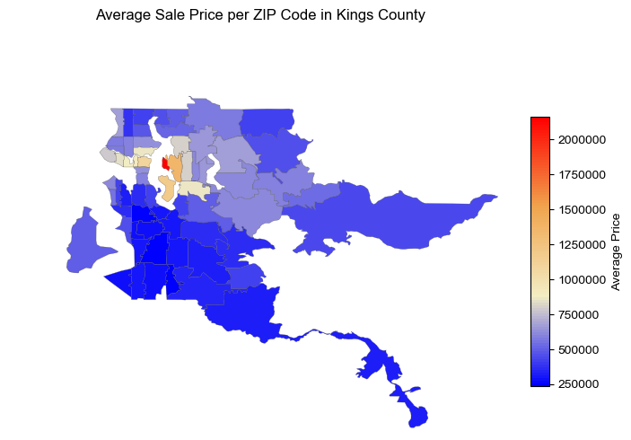
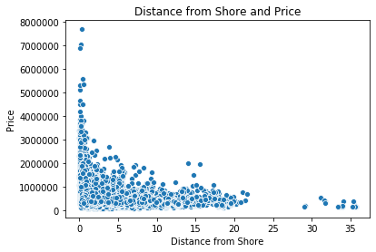
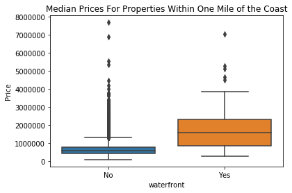
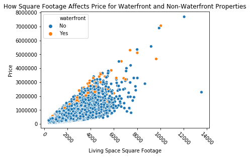
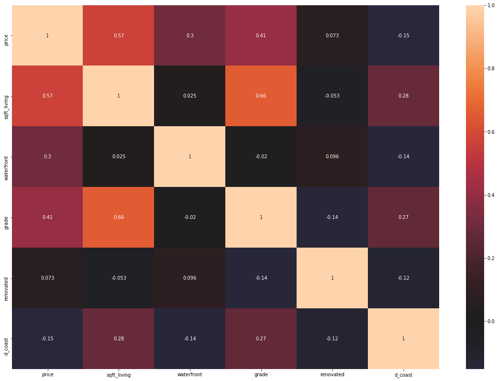
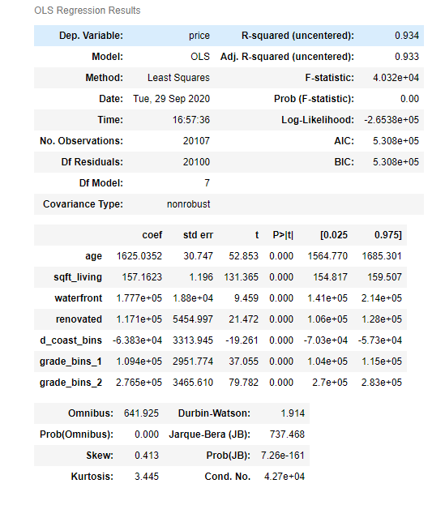
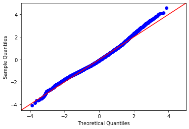
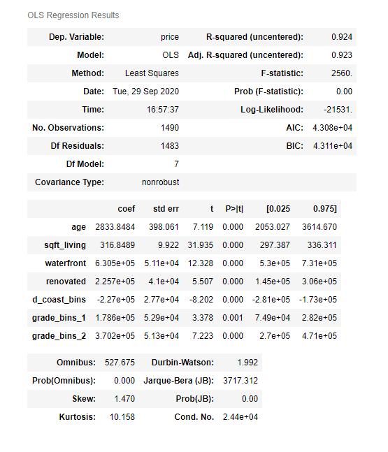
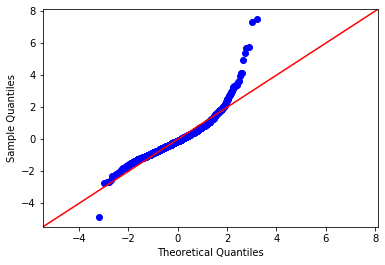

## Introduction
There are many factors that can affect a house's price, including the square footage, the location, and even the value of the surrounding properties. What we wanted to do was come up with a model that could reliably predict the price of a property, given a list of its characteristics. Since each home doesn't exist in a vacuum, its very likely that the price is affected by the combination and interaction of different features.

We used the King's County housing dataset from May 2014 to May 2015 and as such, this model can only be considered valid for this particular dataset. 

## Methodology

### The Dataset
We used the Kings County housing dataset from May 2014 to May 2015 which contains the following datapoints.
* **id** - unique identified for a house
* **dateDate** - house was sold
* **pricePrice** -  is prediction target
* **bedroomsNumber** -  of Bedrooms/House
* **bathroomsNumber** -  of bathrooms/bedrooms
* **sqft_livingsquare** -  footage of the home
* **sqft_lotsquare** -  footage of the lot
* **floorsTotal** -  floors (levels) in house
* **waterfront** - House which has a view to a waterfront
* **view** - Has been viewed
* **condition** - How good the condition is ( Overall )
* **grade** - overall grade given to the housing unit, based on King County grading system
* **sqft_above** - square footage of house apart from basement
* **sqft_basement** - square footage of the basement
* **yr_built** - Built Year
* **yr_renovated** - Year when house was renovated
* **zipcode** - zip
* **lat** - Latitude coordinate
* **long** - Longitude coordinate
* **sqft_living15** - The square footage of interior housing living space for the nearest 15 neighbors
* **sqft_lot15** - The square footage of the land lots of the nearest 15 neighbors

We added a distance form shoreline metrix by creating a map of the coastline and used the latitude and longitude measurements to calculate the distance from the coastline for each property. 

### Exploring the Data

Looking at the dataset, we are given pricing, geographical data, size of the property, the condition and the grade of the property. Preliminary analysis of the data seems to suggest that the location of the property is one of the strongest indicators for pricing, we're going to start and looking at what exactly is important about the location.

Since this housing market is close to a body of water, we're looking at the relationship between the distance from the shoreline and the price. The scatterplot below plots the relationship we saw in the heatmap previously, that there is an increase in price for properties the closer they are to the shoreline.

Now we're going to look at properties that have the waterfront label, this means that not only are they close to the water, but they are also facing the water as well. Waterfront facing properties on average have a higher value than their non waterfront facing neighbors. 

As the size of the property increases, so to does the value of the property. This relationship is supported in both waterfont and non-waterfront properties. 

## The Model

We ended up selecting the following features for our model due to their having the best results

We decided it would be best to split our model up into two different groups, one group for houses over one million, and one group for houses under one million, since the model behaved slightly differently for the higher valued properties, and those looking to spend over a million on a home and those looking to spend under a million are going to be have different priorities for what is important. 

We also binned the grades and the distance from the coast. Grade was grouped into three groups: less than 7, between 7 and 8, and greater than 8. Distance from coast was grouped as those within a quarter of a mile of the coast, and those that are not. 

### Under One Million
The R-Squared and Adjusted R-Squared values are .934 and .933, which are very respectable values. This supports that our model is fitting to the data.

Our coefficients all have significant p values.
As age, square footage or grade, increase, so too does the value.
Waterfront facing or renovated properties have a higher value than each of their counterparts.
Properties that are further than .25 miles away from a shoreline have a lower value than those that are closer.

The QQ plot seems to be very linear, with very minor deviation at the tails. 

### Over One Million
The model for homes over one million has an almost identical relationship as the model for the homes under one million, with the difference being in the values of the coefficients and the R-Squared values. 

The R-Squared and Adjusted R-Squared values are .924 and .923, which are very respectable values. This supports that our model is fitting to the data.

The QQ plot for these homes is a bit worse than the one for homes under one million, however the deviation is largely concentrated at the tails. This does suggest that there might be some outliers that weren't removed or accounted for in this model. 

## Conclusions

#### 1) Waterfront Properties have High Value
The highest valued properties are those that are facing the waterfront. If a waterfront property is desired, expect to pay a higher price for the luxury of the waterfront.

#### 2) Properties Close to the Coast Have Higher Value
Related to waterfront properties are those that are closer to the coast, but aren't necessarily facing the water itself. These properties are also highly valued, resulting in the areas immediately surrounding a shoreline to have a higher value than would be normally expected.

#### 3) The Grade Matters
The grade of the home has a significant effect on the value of the home, and those looking to sell their home for a higher value should seek out ways to increase the grade of their home. 

## Future Work
Future work for this project would include looking more in detail with the geographical data, such as looking at the distance from major highways, cities, or airports. We could also look at crime statistics for each of the neighborhoods and see how that would affect the price. 

Finally, looking at population statistics for each of the neighborhoods would also be interesting. We would like to see how the population densities affect the price and if that could be used as an approximation for demand. 

